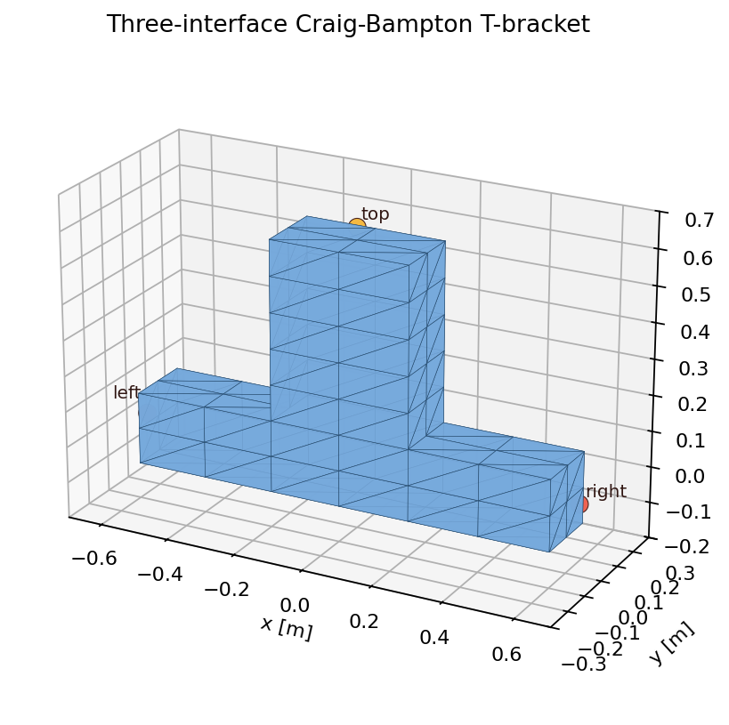

# Three-interface Craig–Bampton T-bracket

This example uses an extruded T-bracket as a minimal three-port
Craig–Bampton component. The left, right, and top arm-end faces are each
condensed to a rigid six-degree-of-freedom interface:

```text
                    top interface
                         ║
                         ║
                         ║
    left interface ══════╩══════ right interface
```

The shape is deliberately plain. Each port is a flat, non-overlapping mesh
face with enough nodes to represent three translations and three rotations;
the central junction creates coupling among all three interfaces. This makes
the model easier to inspect than a production bracket while still exercising
the multi-interface behavior that a straight two-ended brick cannot.



Run the Newton example with:

```bash
uv run --extra examples python \
    newton/examples/fea/cb_multi_interface/example_cb_multi_interface.py \
    --viewer gl
```

## Independent reference

[`generate_cb_multi_interface.m`](generate_cb_multi_interface.m) is compatible
with MATLAB and Octave and does not require PDE Toolbox. It:

1. creates a conforming structured tetrahedral mesh of the T-bracket;
2. assembles consistent full-FEM mass and stiffness matrices;
3. condenses the three rigid interfaces and retains six fixed-interface modes;
4. constructs classical damping at a two-percent modal damping ratio; and
5. integrates the dense Craig–Bampton equations with implicit Euler.

The demonstration uses a deliberately soft `1 MPa` linear material so the
recovered displacement is visible at the object's true scale. The Octave
reference reaches approximately `31.5 mm` peak probe displacement. The
visualizer plots the dominant Newton and Octave displacement histories on the
same millimeter scale and reports their running maximum difference.

The default demonstration drives the top port around its local `+Z` axis with

```text
theta(t) = pi sin(2 pi t / 4 s).
```

It therefore moves smoothly from zero to `+180` degrees, through zero to
`-180` degrees, and back to zero over four seconds. The large angle belongs
to the rigid frame, while the Craig–Bampton coordinates contain only the
small elastic response in the co-rotating frame. This separation is required:
putting `pi` radians directly into a linear interface coordinate would violate
the small-rotation assumption.

The top fixture uses the same finite six-DOF stiffness in Octave and Newton.
Octave applies the corresponding rotating-base inertia load to the dense
24-coordinate ROM. Newton solves its coupled floating-frame/modal system and
reconstructs those same 24 coordinates. The example compares reduced
coordinates and four recovered displacement probes at all 1,200 simulation
substeps; the visualizer shows the running relative errors.

The generator also retains the earlier balanced-port regression: `+Z` force
at the left and right ports and twice that force in `-Z` at the top port.
That secondary load has zero resultant force and moment and exercises all
three ports without rigid-body motion.

Regenerate the CSV files with:

```bash
cd newton/examples/fea/cb_multi_interface
octave --quiet generate_cb_multi_interface.m
```

The rotating reference recurrence is:

```text
(M + Δt C + Δt² K_supported) vₙ₊₁ =
    M vₙ + Δt (-M R_rz alphaₙ₊₁ - K_supported qₙ)
qₙ₊₁ = qₙ + Δt vₙ₊₁
```

Here `K_supported` includes the top fixture stiffness and `R_rz` is the
Craig–Bampton rigid-motion column for rotation about local `Z`. This anchor
checks the FEM-to-Craig–Bampton export, finite top-axis driving, fixture
compliance, implicit integration, and surface recovery. Centrifugal
stiffening, contact, and nonlinear material behavior are outside this linear
small-strain benchmark.

The checked-in reference artifacts were generated with GNU Octave 9.2 and
then exercised by the Newton example's 1,200-substep trajectory comparison.
