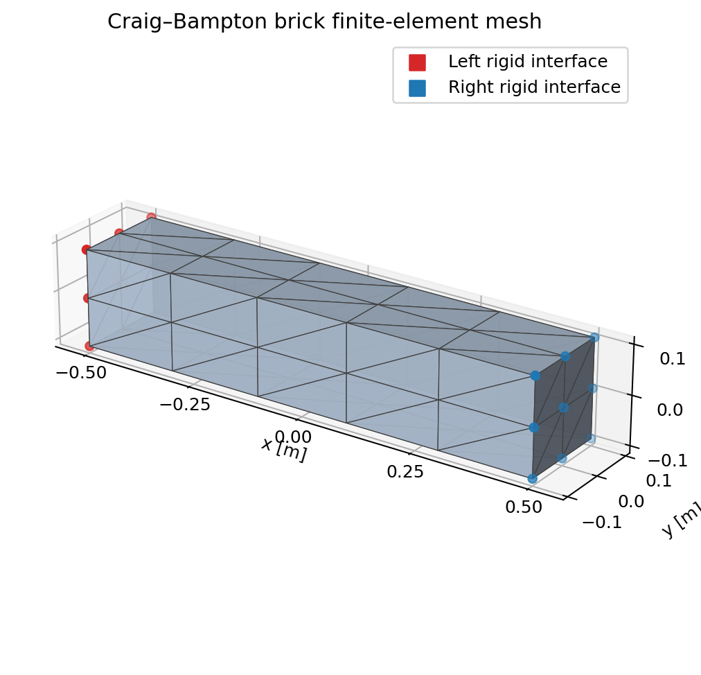

# Craig-Bampton ROM Elastic Links

This example demonstrates a Craig-Bampton reduced-order model (ROM) generated
by Octave-compatible MATLAB code and loaded into Newton. In an industrial
application, the ROM data could instead be exported by an FEA product such as
MATLAB, Ansys, Nastran, or Simcenter.



The brick has one six-degree-of-freedom rigid interface at each end and retains
the two lowest fixed-interface vibration modes. The checked-in CSV files contain
the reduced mass, stiffness, and damping matrices, along with the surface
recovery data used for visualization. They allow the Python example to run
without MATLAB or Octave. See
[`example_brick_CB.m`](example_brick_CB.m) for the export pipeline and
[`EXPORT_FORMAT.md`](../../../../EXPORT_FORMAT.md) for the file layout.

## Moving-interface example

Run the moving-interface example with:

```bash
uv run --extra examples python \
    newton/examples/fea/craig_bampton_ROM_elastic_links/example_craig_bampton_rom.py
```

This example drives the left interface through a vertical translation and
rotation while the right interface responds dynamically. Its `test_final()`
maps the Newton modal state back to the exported Craig-Bampton coordinates and
checks that the fixed-interface modes contribute measurable surface
displacement. Displacement coloring is scaled to make the small elastic response
visible.
The viewer controls can be used to vary the ROM's mass, stiffness, and damping
scales.
